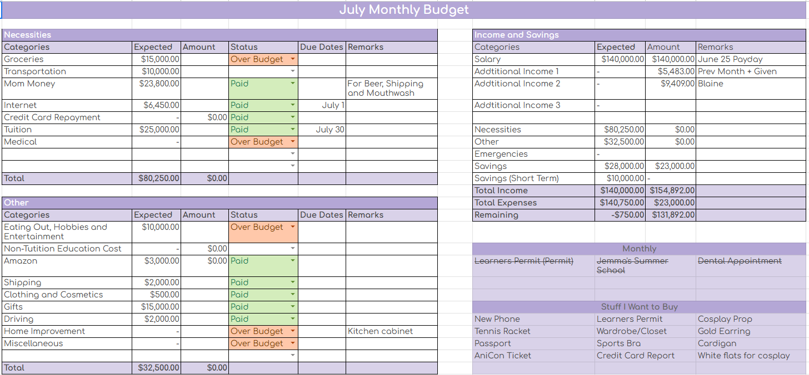
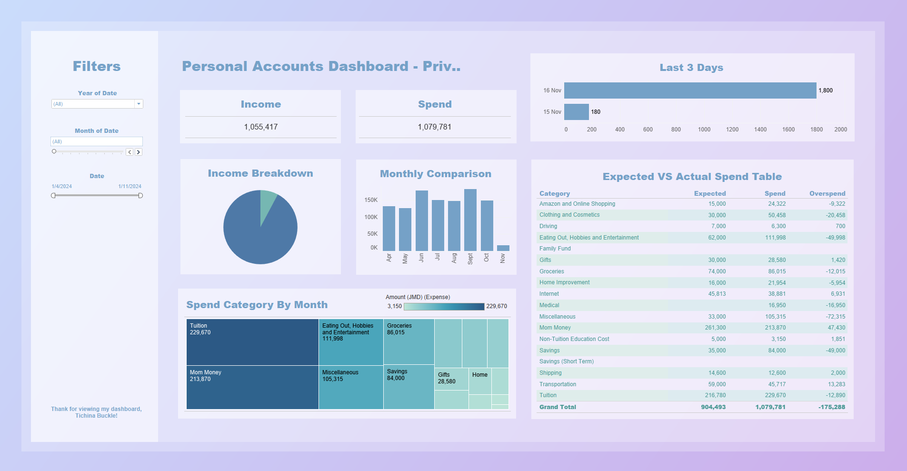

# Personal-Finance-Tracker-Web-App
#### Working Title: **Sunrise** Budgeting and Personal Finance Web Application
#### Author: Tichina Buckle
#### Last Updated: March 28, 2025
#### Current Version: v28-03-2025

## Project Background
Financial management is a critical life skill that many individuals struggle with. As a data science student, I recognized a common challenge among friends and peers: the difficulty of tracking personal finances effectively, understanding spending patterns, and making informed financial decisions.

## Project Challenge
Create a comprehensive visual analytics solution to track personal spending patterns and identify opportunities for financial optimization. The core objectives are to:
- Simplify complex financial data
- Provide actionable insights
- Enable users to make informed financial decisions
- Create an intuitive, accessible financial tracking tool

## Project Evolution

### Version 1 (Spreadsheet)

- **Challenge:** Develop a basic system for consistent financial tracking
- **Approach:** 
  - Manually created spreadsheet for recording financial transactions
  - Limited visibility into spending patterns
  - Basic categorization of expenses
- **Limitations:**
  - Time-consuming manual data entry
  - Difficult to generate meaningful insights
  - No automated analysis
- **Key Learning:** Need for a more automated, user-friendly solution

### Version 2 (Tableau Dashboard)

- **Challenge:** Create a comprehensive visual analytics solution for personal finance
- **Approach:** 
  - Designed a structured data collection system using Google Forms for consistent daily financial tracking
  - Implemented automated data cleaning pipelines in Google Sheets to standardize transaction categories
  - Developed an interactive Tableau dashboard with multiple interconnected views
- **Key Features:**
  - Expense breakdowns by category
  - Comparison of budget and actual spend
  - Month-over-month spending comparisons
- **Results:** 
  - Identified 3 key spending categories with potential for 15% reduction
  - Created a dynamic, visually appealing financial dashboard
- **Insights:**
  - Visualization makes financial patterns more understandable
  - Data-driven approach to spending optimization
  - Importance of consistent, structured data collection

### Version 3 (Web Application - Current)
**Status:** In Progress 🚧

#### Evolved Challenges
- Create a more accessible and user-friendly financial tracking tool
- Provide real-time insights and predictive analysis
- Support offline functionality
- Ensure cross-device compatibility
- Make financial tracking less intimidating for non-technical users

#### Key Innovation Goals
- Develop an intuitive interface that simplifies financial management
- Implement advanced analytics to provide proactive financial advice
- Create a seamless, integrated financial tracking experience
- Empower users to make informed financial decisions

## Technical Stack (Planned)
- **Frontend:** React.js
- **Backend:** Node.js
- **Database:** MongoDB
- **Authentication:** Firebase
- **Deployment:** Heroku/Netlify

## Roadmap Features
1. Comprehensive Expense Tracking
2. Budget Planning and Alerts
3. Financial Goal Setting
4. Investment Tracking
5. Predictive Spending Insights
6. Multi-device Synchronization
7. Offline Mode Functionality

## Contact & Collaboration
**Interested in the project?**
- Feedback welcome
- Collaboration opportunities open
- Seeking beta testers and user insights

**Connect:**
- **Email:** tichinabuckle@gmail.com
- **LinkedIn:** [@tichinabuckle](https://www.linkedin.com/in/tichinabuckle/)

## Future Vision
Transform personal finance tracking from a chore into an empowering, insightful experience that helps individuals take control of their financial health.